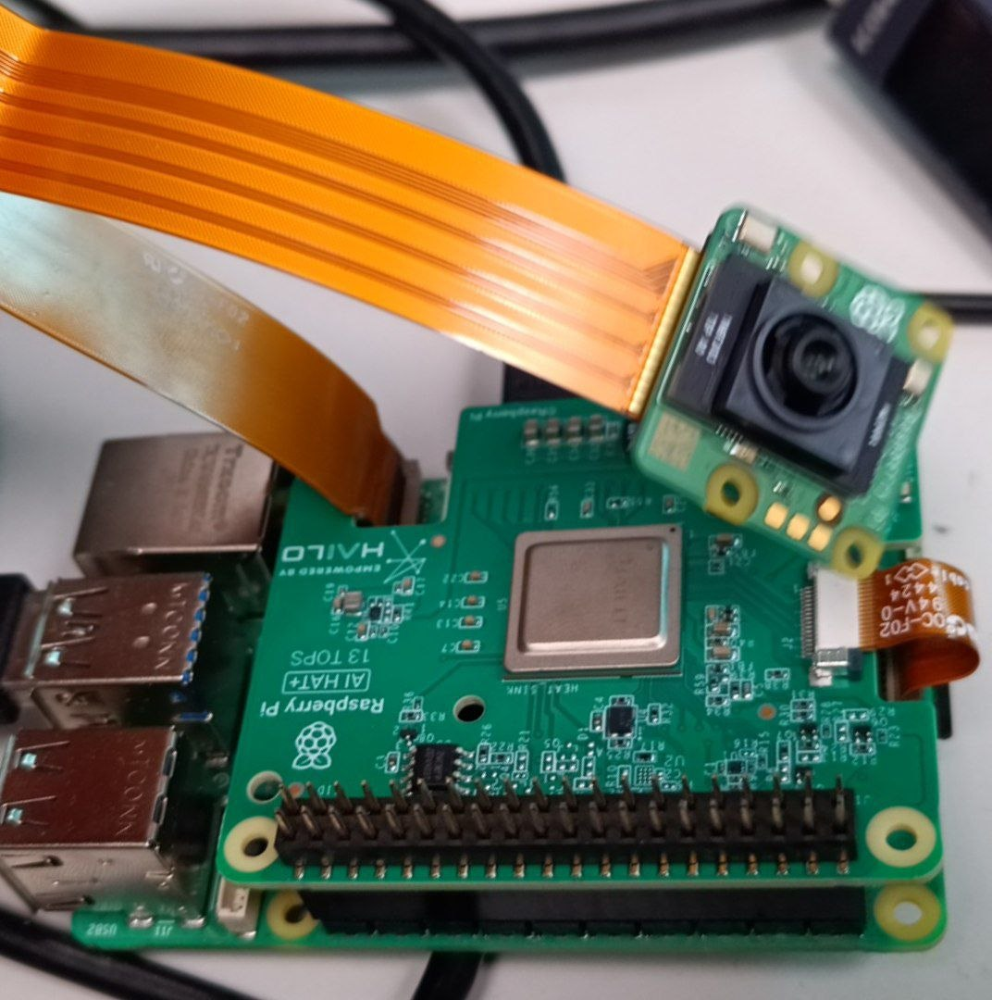

# Physical setup


The physical setup consists of a Raspberry PI 5 with the RPI AI Hat+, 13 TOPS version.

We use the Sony IMX500 as image sensor to make the image acquisition component comparable.

# Requirements

This part requires the matching Hailo components to be installed in the RPI.
Namely, HailoRT and Hailo apps (https://github.com/hailo-ai/hailo-apps)


# Latency measurement

The latency command is assumed to be run in a folder where the .hef models are located.

``` 
hailortcli run -c 900 --batch-size 1 --measure-latency --csv "./results/results.csv" .	
```

## Options

- **c** sets the amount of frames (in this case, 900 to mirror the 900 frames of the IMX500 benchmark)
- **batch-size** sets the batch size. in this case, we set 1 because we will be reading frame by frame
- **measure-latency** will measure the inference latency
- **csv** will save the results in a .csv file
- **.** signals the current directory, as per the assumption above

# Energy measurement

Similarly to the IMX500, this section assumes you have an external tool to measure the energy consumption.

The energy measurement script is *imx500_test.py*.

The file *'hailo_inferece'* models a Hailo pipeline for synchronous inference and is adapted from https://github.com/SangatsuUsagi/hailo_inference_pipeline/tree/main 
